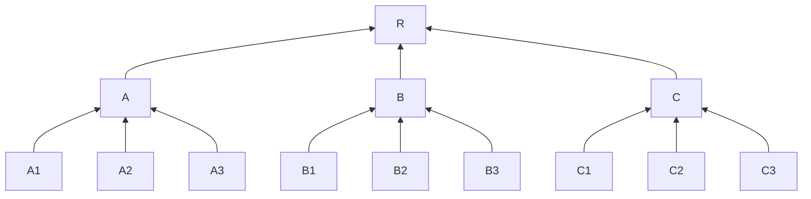
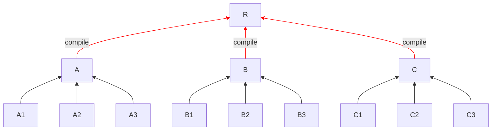
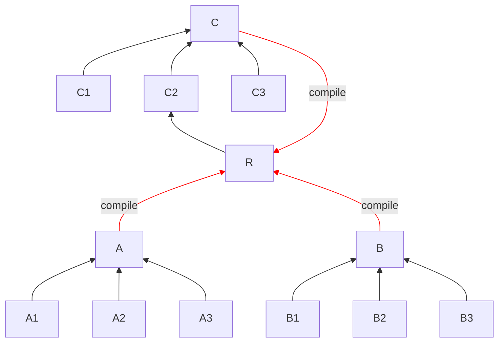

# Compilation time benchmarks of BEAM languages

This repository contains synthetic benchmarks of compilation times
across BEAM languages (currently Elixir and Gleam), with the goal
to publicly quantify performance claims.

## `benchmark_*`

It measures the time to compile 100 independent modules with 100 hello
world functions each, boot the application, and run a minimal test suite.

To compute times in Gleam:

``` 
$ cd benchmark_gleam
$ gleam test
$ rm -rf build/dev/erlang/benchmark_gleam/ && time gleam test
```

To compute times in Elixir:

```
$ cd benchmark_elixir
$ mix test
$ rm -rf _build && time mix test
```

On a MacStudio M1, the following values are reported (average
of 5 runs):

| Gleam v1.14 | Elixir v1.19 | Elixir v1.20 | Elixir v1.20 (interpreted defmodule)
|---|---|---|---|
| ~0.78s | ~0.95s | ~0.80s | ~0.72s |

The times between Gleam and Elixir are within the error margin.
The [new interpreted module definition in Elixir v1.20](https://github.com/elixir-lang/elixir/pull/15087)
makes it roughly 10% faster. All using Erlang/OTP 28.1.

## `runtime_cycle_*`

The goal of this benchmark is to observe the impact of compile-time
dependencies in both languages and assess how their incremental
compilation works.

Both projects have a chain of 100 modules where `A1 -> A2 -> ... -> A100`.
They show that:

* Changing a100 in Gleam requires all other modules to compile
* Changing A100 in Elixir requires no other modules to compile

This happens because Elixir can actually distinguish between two
types of dependencies: compile-time and runtime dependencies.
Gleam v1.14 treats all dependencies as compile-time dependencies.

When it comes to cycles, making the Elixir modules a cycle does not
change the results above, as long as they remain runtime depdendencies.
On the other hand, Gleam cannot have cycles.

Furthermore, you can manipulate the Elixir repository to understand
the impact of compile-time dependencies. For example, by making it so
A100 depends on A1 (creating a cycle) and making it so A1 depends on
A2 at compile-time (simply call A2 in A1 module body), you will notice
it doesn't force the cycle to recompile, only compile-time dependencies.

Overall, we expect Gleam to recompile more files on each change.
You can read the detailed explanation below for more information.

### Incremental compilation averages

To try to better visualize the impact of dependencies in both, let's consider
a small tree. We will use a balanced tree, cause it is easier to reason about.

Imagine you have this file structure, A1/A2/A3 depends on A which depends on R
and so on:



In Gleam, if you change R, all nodes downstream are compiled. If you change A,
A1/A2/A3 are recompiled. And so on. So if you change a file at random, the average
amount of files recompiled per change is `(13 + 3*4 + 9*1) / 13`, which is 2.61.

However, in Elixir, it won't propagate unless you have compile-time dependencies,
so the default average is 1. But apps will certainly have compile-time dependencies
too, so let's imagine `A`, `B`, and `C` depend on `R` as a compile-time dependency
(like Phoenix apps all have `use MyAppWeb, :controller`) and mark it in red. We end-up
with this:



This makes it so 3 out of 12 edges are compile-time edges.

> For comparison purposes, the [Livebook](https://github.com/livebook-dev/livebook)
> project has a ratio of 17% compile-time edges per runtime ones,
> so the rate above of 25% is higher than the one found in real-world project.

Now, when R changes, it compiles A, B and C, but that's the only change. This is
because any runtime dependency stops the compilation from propagating. Our
recompilations per file average then becomes `(4 + 3*1 + 9*1) / 13`, which is 1.23.
Less than half of Gleam's.

But what happens if we introduce a cycle? Let's say that R depends on C2:



What this means is that, anything in that path (C and C2) will trigger R,
so now we have the following dependencies is:

* R changes, we compile: R, A, B, C
* C changes, we compile: A, B, C
* C2 changes, we compile: A, B, C, C2

Everything else stays the same, so we have `(4 + 3 + 4 + 10) / 13`,
which is 1.61 and still well below Gleam's average for this tree.

> When R depends on C2, we have a so-called compile-connected dependency,
> and [we have tooling in `mix` to help find them](https://hexdocs.pm/mix/Mix.Tasks.Xref.html)!

Even if we made A2 and B2 cycles, similar to C2, the average is 2.4
and still below Gleam's. For comparison purposes, the Livebook project
at the time of writing has 300 files and a single compile-time cycle
with 2 compile-time edges, so it is unlikely for a tree with 13 files
to have 3 cycles with 3 compile-time dependencies each (which still
triggers fewer recompilations than Gleam).

The tree above helps illustrate how Elixir, by distinguishing between
compile-time and runtime dependencies, can reduce the amount of work
on each incremental compilation. Gleam requires on average to recompile
more files, as changes always forces callers to recompile, likely due
to type inference.
