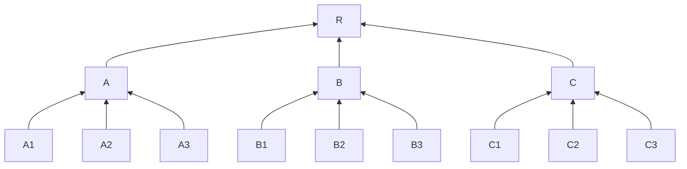
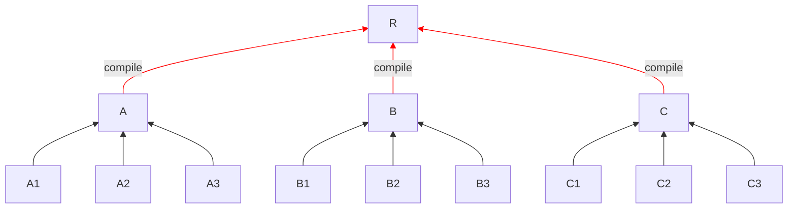
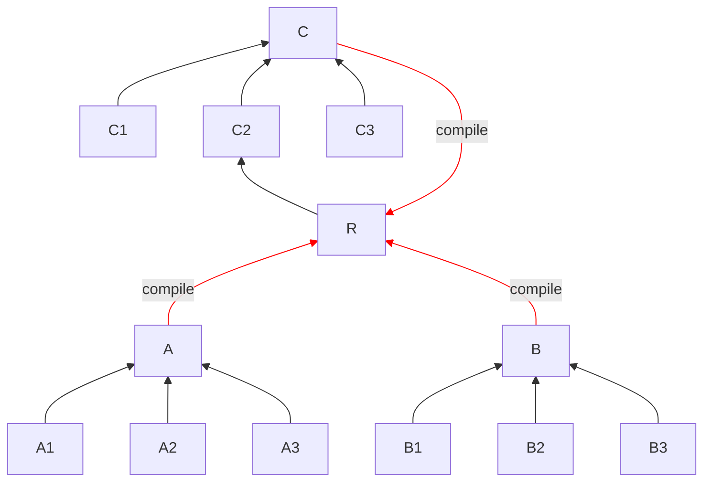

# Compilation time benchmarks of BEAM languages

This repository contains synthetic benchmarks of compilation times
across BEAM languages (currently Elixir, Erlang, and Gleam), with the goal
to publicly quantify performance claims.

## `benchmark_{language}`

It measures the time to compile 100 independent modules with 100 hello
world functions each, boot the application, and run a minimal test suite.

We list the steps for each language. The goal is measure the time to
compile the project after dependencies have been analyzed and compiled.

To compute times in Gleam:

``` 
$ cd benchmark_gleam
$ gleam test
$ rm -rf build/dev/erlang/benchmark_gleam/ && time gleam test
```

To compute times in Elixir:

```
$ cd benchmark_elixir
$ mix test
$ rm -rf _build && time mix test
```

To compute times in Erlang:

```
$ cd benchmark_erlang
$ rebar3 eunit
$ rm -rf _build && rebar3 get-deps && time rebar3 eunit
```

On a MacStudio M1, the following values are reported (average
of 5 runs):

| Language | Time on Erlang/OTP 28 |
|----------|-----------------------|
| Elixir v1.19 | ~0.73s |
| Elixir v1.20-rc.2 | ~0.63s |
| Elixir v1.20-rc.2 ([interpreted defmodule](https://github.com/elixir-lang/elixir/pull/15087)) | ~0.58s |
| Erlang (`rebar3`) | ~0.72s |
| Gleam v1.14 | ~0.71s |

Additionally, [I have recently pushed a patch which improves
boot times in Erlang/OTP](https://github.com/erlang/otp/pull/10615).
Here are the updated measurements:

| Language | Time on Erlang/OTP 29 |
|----------|-----------------------|
| Elixir v1.19 | ~0.65s |
| Elixir v1.20-rc.2 | ~0.55s |
| Elixir v1.20-rc.2 ([interpreted defmodule](https://github.com/elixir-lang/elixir/pull/15087)) | ~0.50s |
| Erlang (`rebar3`) | ~0.64s |
| Gleam v1.14 | ~0.67s |

As you can see, the pull request improved the timing across
the board! 🎉

At the time of writing, Elixir v1.20-rc.2 offers the best performance
across both Erlang/OTP versions, with the new [interpreted module
definition](https://github.com/elixir-lang/elixir/pull/15087)
as more than 20% faster than other language tooling.

## `incremental_{language}`

The goal of this benchmark is to observe the impact of dependencies
between modules in languages and assess how their incremental compilation
works.

In broad terms, we can classify the dependencies between modules in two
types:

* Compile-time dependencies: force the callers of a module to recompile
  when said module changes

* Runtime dependencies: callers of a module do not need to recompile
  when said module changes

In this benchmark, we have modified the first benchmark so one module
calls functions in subsequent modules: `A1 -> A2 -> ... -> A100`.
The benchmarks show that:

* Changing a100 in Gleam requires all other modules to compile
* Changing A100 in Elixir requires no other modules to compile

This happens because Elixir can actually distinguish between the two
types of dependencies: compile-time and runtime dependencies,
while Gleam v1.14 treats all dependencies as compile-time dependencies.

On the other hand, Erlang only has runtime dependencies (except for
parse transforms but they are rarely used in practice), and therefore is
the one with best incremental performance of all languages here.

When it comes to cycles, Gleam cannot have cycles between modules,
while Erlang and Elixir allow so (as long as the cycles are not exclusively
made of compile-time edges).

You can manipulate the Elixir repository to understand the impact of cycles
and compile-time dependencies. For example, by making it so A100 depends on A1
(creating a cycle) and making it so A1 depends on A2 at compile-time
(simply call A2 in A1 module body), you will notice changing A100 doesn't
force the whole cycle to be recompiled, only compile-time dependencies are.
This is because runtime dependencies effectively act as a break mechanism
to avoid recompilation.

Overall:

| Language | Dependency types | Cycles allowed | Expected recompilations per change |
|----------|------------------|----------------|------------------------------------|
| Erlang | Runtime only | Yes | Lowest |
| Elixir | Runtime + Compile-time | Yes | Moderate |
| Gleam | Compile-time only | No | Highest |

The next section provides a more in-depth analysis on a balanced tree as an example.

### Incremental compilation averages

To try to better visualize the impact of dependencies in both, let's consider
a small tree. We will use a balanced tree cause it is easier to visualize it.

Imagine you have this file structure, A1/A2/A3 depends on A which depends on R
and so on:



In Gleam, if you change R, all nodes downstream are compiled. If you change A,
A1/A2/A3 are recompiled. And so on. So if you change a file at random, the average
amount of files recompiled per change is `(13 + 3*4 + 9*1) / 13`, which is 2.61.

However, in Elixir, it won't propagate unless you have compile-time dependencies,
so the default average is 1. But apps will certainly have compile-time dependencies
too, so let's imagine `A`, `B`, and `C` depend on `R` as a compile-time dependency
(like Phoenix apps all have `use MyAppWeb, :controller`) and mark it in red. We end-up
with this:



This makes it so 3 out of 12 edges are compile-time edges.

> For comparison purposes, the [Livebook](https://github.com/livebook-dev/livebook)
> project has a ratio of 17% compile-time edges per runtime ones,
> so the rate above of 25% is higher than the one found in real-world project.

Now, when R changes, it compiles A, B and C, but that's the only change. This is
because any runtime dependency stops the compilation from propagating. Our
recompilations per file average then becomes `(4 + 3*1 + 9*1) / 13`, which is 1.23.
Less than half of Gleam's.

But what happens if we introduce a cycle? Let's say that R depends on C2:



What this means is that, anything in that path (C and C2) will trigger R,
so now we have the following dependencies is:

* R changes, we compile: R, A, B, C
* C changes, we compile: A, B, C
* C2 changes, we compile: A, B, C, C2

Everything else stays the same, so we have `(4 + 3 + 4 + 10) / 13`,
which is 1.61 and still well below Gleam's average for this tree.

> When R depends on C2, we have a so-called compile-connected dependency,
> and [we have tooling in `mix` to help find them](https://hexdocs.pm/mix/Mix.Tasks.Xref.html)!

Even if we made A2 and B2 cycles, similar to C2, the average is 2.4
and still below Gleam's. For comparison purposes, the Livebook project
at the time of writing has 300 files and a single compile-time cycle
with 2 compile-time edges, so it is unlikely for a tree with 13 files
to have 3 cycles with 3 compile-time dependencies each (which still
triggers fewer recompilations than Gleam).

The tree above helps illustrate how Elixir, by distinguishing between
compile-time and runtime dependencies, can reduce the amount of work
on each incremental compilation. Gleam requires on average to recompile
more files, as changes always forces callers to recompile, perhaps due
to type reconstruction.
