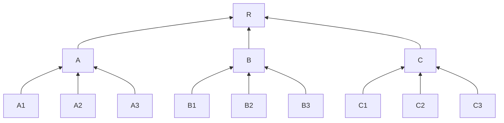
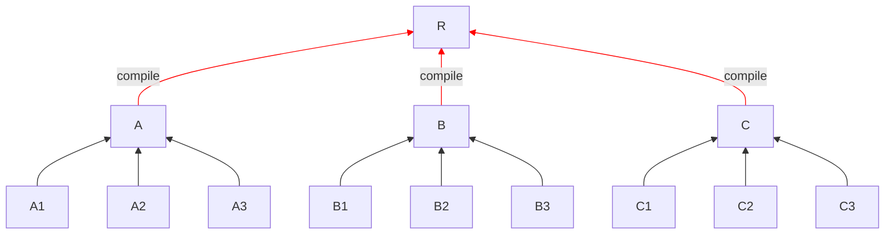
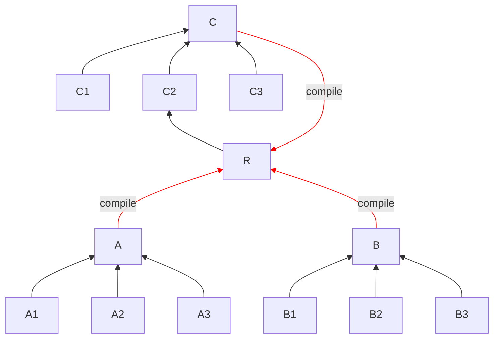

# Compilation time benchmarks of BEAM languages

This repository contains synthetic benchmarks of compilation and build times
across BEAM languages (currently Elixir/Mix, Erlang/rebar3, and Gleam),
with the goal to publicly quantify performance claims.

## `benchmark_{language}` (compilation)

It measures the time to compile 100 independent modules with 100 hello
world functions each. We list the steps for each language.

To compute times in Gleam:

``` 
$ cd benchmark_gleam
$ rm -rf test
$ rm -rf build && time gleam build
```

To compute times in Elixir:

```
$ cd benchmark_elixir
$ mix compile
$ rm -rf _build && time mix compile
```

To compute times in Erlang:

```
$ cd benchmark_erlang
$ rebar3 compile
$ rm -rf _build && rebar3 get-deps && time rebar3 compile
```

On a MacStudio M1, the following values are reported (average of 5 runs):

| Language | Time on Erlang/OTP 29 |
|----------|-----------------------|
| Elixir v1.20 | ~0.53s |
| Elixir v1.20 ([interpreted defmodule](https://github.com/elixir-lang/elixir/pull/15087)) | ~0.48s |
| Erlang (`rebar3`) | ~0.64s |
| Gleam v1.18 | ~0.44s |

Gleam comes first with Elixir in interpreted mode close in second.
This benchmark also shows there is room for improvements in `rebar3`,
as we should expect it to be in the same ballpark as `mix`.

## `benchmark_{language}` (test)

It measures the time to compile 100 independent modules with 100 hello
world functions each and then boot the application and run the test suite.
The goal of this benchmark is to show a common workflow during development.

To compute times in Gleam, first uncomment the dev-dependencies in gleam.toml and then:

```
$ cd benchmark_gleam
$ git checkout test
$ gleam test
$ rm -rf build/dev/erlang/benchmark_gleam/ && time gleam test
```

To compute times in Elixir:

```
$ cd benchmark_elixir
$ mix test
$ rm -rf _build && time mix test
```

To compute times in Erlang:

```
$ cd benchmark_erlang
$ rebar3 compile
$ rm -rf _build && rebar3 get-deps && time rebar3 eunit
```

On a MacStudio M1, the following values are reported (average of 5 runs):

| Language | Time on Erlang/OTP 29 |
|----------|-----------------------|
| Elixir v1.20 | ~0.55s |
| Elixir v1.20 ([interpreted defmodule](https://github.com/elixir-lang/elixir/pull/15087)) | ~0.50s |
| Erlang (`rebar3`) | ~0.64s |
| Gleam v1.18 | ~0.67s |

As you can see, both Erlang and Elixir jump ahead, likely because
Gleam has to boot the Erlang VM twice, once to compile, and then
again to run tests, which `rebar3` and `mix` does it within a
single instance.

## `incremental_{language}`

The goal of this benchmark is to observe the impact of dependencies
between modules in languages and assess how their incremental compilation
works.

In broad terms, we can classify the dependencies between modules in two
types:

* Compile-time dependencies: force the callers of a module to recompile
  when said module changes

* Runtime dependencies: callers of a module do not need to recompile
  when said module changes

In this benchmark, we have modified the benchmark above so each module
calls functions in the subsequent module: `A1 -> A2 -> ... -> A100`.
The benchmarks show that:

* Changing a100 in Gleam requires all other modules to compile
* Changing A100 in Elixir requires no other modules to compile

This happens because Elixir can actually distinguish between the two
types of dependencies, compile-time and runtime dependencies,
while Gleam v1.14 treats all dependencies as compile-time dependencies.

In practice, most Elixir projects will have compile-time dependencies,
and you can manipulate the Elixir repository to understand their impact.
For example, by making it so A51 depends on A52 at compile-time (to do so,
simply call `A52.hello1` in A51's module body), you will notice that changing
any file from A52 to A100 now causes A51 to recompile, but no additional file.
This is because runtime dependencies effectively act as a break mechanism
to avoid recompilation.

On the other hand, Erlang only has runtime dependencies (except for
parse transforms but they are rarely used in practice), and therefore is
the one with best incremental performance of all languages here:
changing a file only causes that file to be recompiled.

When it comes to cycles, Gleam cannot have cycles between modules,
while Erlang and Elixir allow so (as long as the cycles are not exclusively
made of compile-time edges). However, the cycles do not change how compile-time
and runtime dependencies propagate: even if A100 depends on A1, forming a cycle,
changing a file will only cause compile-time dependencies to recompile, and not
the whole cycle.

Overall:

| Language | Dependency types | Cycles allowed | Expected recompilations per change |
|----------|------------------|----------------|------------------------------------|
| Erlang | Runtime only | Yes | Lowest |
| Elixir | Runtime + Compile-time | Yes | Moderate |
| Gleam | Compile-time only | No | Highest |

The next section provides a more in-depth analysis on a balanced tree so it is
easier to visualize those dependencies.

### Incremental compilation averages

To try to better visualize the impact of dependencies in different languages,
let's consider a small tree. We will use a balanced tree to simplify the example.

Imagine you have a file structure where A1/A2/A3 depends on A which depends on
R (root) and so on:


```mermaid
graph BT
    A1 --> A
    A2 --> A
    A3 --> A
    B1 --> B
    B2 --> B
    B3 --> B
    C1 --> C
    C2 --> C
    C3 --> C
    A --> R
    B --> R
    C --> R
```

In Gleam, if you change R, all nodes downstream are compiled. If you change A,
A1/A2/A3 are recompiled. And so on. So if you change a file at random, the average
amount of files recompiled per change is `(13 + 3*4 + 9*1) / 13`, which is 2.61.

However, in Elixir, only compile-time dependencies are recompiled, so if you have no
compile-time dependnecy, the default average is 1 (the same as Erlang). But apps will
certainly have compile-time dependencies too, so let's imagine `A`, `B`, and `C` depend
on `R` as a compile-time dependency (like Phoenix apps all have `use MyAppWeb, :controller`)
and mark it in red. We end-up with this:


```mermaid
graph BT
    A1 --> A
    A2 --> A
    A3 --> A
    B1 --> B
    B2 --> B
    B3 --> B
    C1 --> C
    C2 --> C
    C3 --> C
    A -->|compile| R
    B -->|compile| R
    C -->|compile| R

    linkStyle 9,10,11 stroke:red
```

This makes it so 3 out of 12 edges are compile-time edges.

> For comparison purposes, the [Livebook](https://github.com/livebook-dev/livebook)
> project has a ratio of 17% compile-time edges per runtime ones,
> so the rate above of 25% is higher than the one found in real-world project.

Now, when R changes, it compiles A, B, and C, but that's the only change. This is
because any runtime dependency stops the compilation from propagating. Our
recompilations per file average then becomes `(4 + 3*1 + 9*1) / 13`, which is 1.23.
Less than half of Gleam's.

But what happens if we introduce a cycle? Let's say that R depends on C2:


```mermaid
graph BT
    A1 --> A
    A2 --> A
    A3 --> A
    B1 --> B
    B2 --> B
    B3 --> B
    C1 --> C
    C2 --> C
    C3 --> C
    A -->|compile| R
    B -->|compile| R
    C -->|compile| R
    R --> C2
    linkStyle 9,10,11 stroke:red
```

What this means is that, anything in that path (C and C2) will trigger R,
so now we have the following dependencies is:

* R changes, we compile: R, A, B, C
* C changes, we compile: A, B, C
* C2 changes, we compile: A, B, C, C2

Everything else stays the same, so we have `(4 + 3 + 4 + 10) / 13`,
which is 1.61 and still well below Gleam's average for this tree.

> When R depends on C2, we have a so-called compile-connected dependency,
> and [we have tooling in `mix` to help find them](https://hexdocs.pm/mix/Mix.Tasks.Xref.html)!

Even if we made A2 and B2 cycles, similar to C2, the average is 2.4
and still below Gleam's. For comparison purposes, the Livebook project
at the time of writing has 300 files and a single compile-time cycle
with 2 compile-time edges, so it is unlikely for a tree with 13 files
to have 3 cycles with 3 compile-time dependencies each (which still
triggers fewer recompilations than Gleam).

The tree above helps illustrate how Elixir, by distinguishing between
compile-time and runtime dependencies, can reduce the amount of work
on each incremental compilation. Gleam requires on average to recompile
more files, as changes always forces callers to recompile, most likely
due to type reconstruction. Erlang projects have the most efficient
incremental compilation.

## Addendum: compilation cost of macros

One remaining question is: what is the cost incurred at compile-time
by using compiler macros? As the ones found in Elixir?

First of all, it is important to highlight that calling a macro itself
is not expensive. Macros are just regular functions that receive code
as data and, as part of compiling any file, the compiler will already
call hundrends of thousands of functions. So the overhead of calling
a macro is minimal.

The cost of macros come from the amount of code it generates/returns.
It is possible to write macros that generate a lot of code which will
have a negative impact on compile-time (which is in itself an
[anti-pattern](https://elixir.hexdocs.pm/macro-anti-patterns.html#large-code-generation)).
On the other hand, macros can also be used to improve compilation times,
either by treating code as data or by integrating it into the compiler.
We will explore both scenarios next.

### Code as data

Imagine that you are building a router for your web application.
The most common format for dealing with those in BEAM languages is
by pattern matching on a list representation of the request path.
For example:

```erlang
% Handles /
route([]) -> ...

% Handles /comments
route(["comments"]) -> ...

% Handles /comments/:id
route(["comments", Id]) -> ...
```

The benefit of using the format above is that the Erlang compiler
will optimize the patterns into a binary tree for efficient runtime
dispatching.

Now imagine that, over time, your application grows to thousands of
routes. Suddenly giving the Erlang compiler thousands of routes to
optimize will increase compilation times non-linearly. If you want
to address those issues, you now need to refactor your routes and
entrypoints by grouping and reorganizing your clauses.

However, if you use macros, you can use a declarative syntax:

```elixir
get "/", to: ...
get "/comments", to: ...
get "/comments/:id", to: ...
```

This allows you treat your routes as data and emit different code
based on the amount and the contents of each route. You may group
them by HTTP verb or by route prefix, provide heuristics based on
the size, and generally optimize the code given to the Erlang
compiler without changing any of your routes declaration.

For completeness, those benefits are not tied to macros. For example,
an Erlang web framework could allow you to define routes as data using
pure functions, as below:

```erlang
routes() ->
  [
    #{verb => get, route => "/", to => ...},
    #{verb => get, route => "/comments", to => ...},
    #{verb => get, route => "/comments/id", to => ...},
  ].
```

And now, when your application initializes in test or prod, it can
compile those routes into a module:

```erlang
compile() ->
  compile:forms(module_from_routes(routes())).
```

This encodes routes as data and allows us to provide the same optimizations
and heuristics as macros. The difference is that it now happens during
initialization rather than compilation.

Note the last example above is still performing meta-programming,
but using a different approach than macros. Generally speaking,
there are many ways to meta-program and there are benefits when it is
integrated into the compiler. Let's see another example.

### Meta-programming aware compiler

Let's study another example of where macros can lead to improved
compilation times due to the compiler integration.

For example, let's look at how
[Unicode generation is done in Erlang](https://github.com/erlang/otp/blob/master/lib/stdlib/uc_spec/gen_unicode_mod.escript)
or how [type safe SQL is emitted by Gleam](https://github.com/giacomocavalieri/squirrel).
In both cases, you have to run an Erlang or Gleam program that parses a source
file in disk, such as the Unicode standard or SQL files, and then emits either
Erlang source and Gleam source. Then you proceed to compile the emitted program
as usual.

For Erlang/Unicode, this means invoking two programs:

    [     Erlang program    ] --> [           Erlang compiler          ]
    Unicode --> Erlang Source     Erlang Source --> Erlang AST --> .beam

For Gleam/SQL, this means invoking three programs:

    [  Gleam program   ] --> [       Gleam compiler       ] --> [           Erlang compiler          ]
    SQL --> Gleam Source     Gleam Source --> Erlang Source     Erlang Source --> Erlang AST --> .beam

However, because Elixir programs can emit code during compilation, [Elixir's
Unicode compilation](https://github.com/elixir-lang/elixir/blob/main/lib/elixir/unicode/unicode.ex)
is effectively a single program:

    [           Elixir program/compiler           ]
    Unicode --> Elixir AST --> Erlang AST --> .beam

Effectively, all three languages are meta-programming (they are writing code that
emits code), the difference is that Elixir does it through Elixir AST, while Erlang
and Gleam do it via textual/source translation. For these reasons, Elixir requires
fewest intermediate representations and fewest program invocations. It is also possible
to achieve similar results as Elixir in Erlang via the user of parse-transforms,
although they are generally discouraged.

The analysis above is not meant to be a criticism of how Unicode or SQL generation
is done in any of these languages. Rather to show that, while compiler macros
can be abused by emitting unneeded code, they can also be used to augment compiler
and build tool performance. Adding macros to a language comes with a series of
trade-offs that need to be evaluated per language. In this addendum we only explore
macros from the compiler angle.
